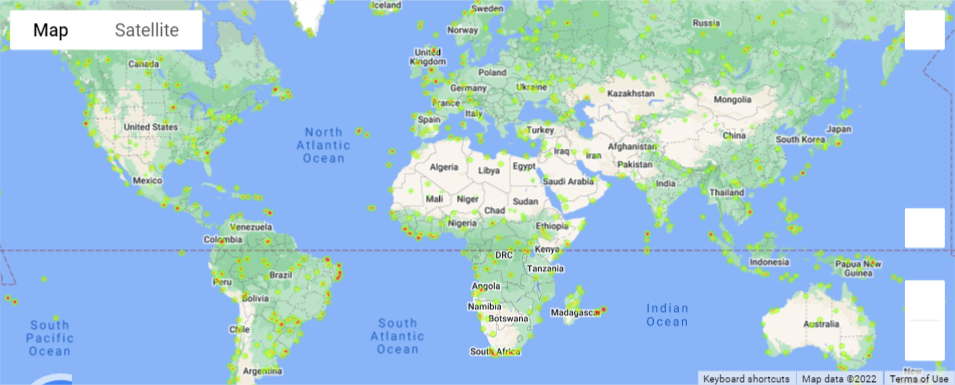

# Python-API-Challenge: OpenWeatherMap and Google Maps APIs
The OpenWeatherMap API was used to obtain weather information for a randomly selected list of coordinates. Based on my idea of ideal weather conditions, the list of locations narrowed down to 8 locations and the nearest hotels to each location were identified via the Google Maps API. With the `gmaps` module, heatmaps were made to show the placement of the large list of locations (weighted by percent humidity), along with markers containing the hotel name, city, and country of the 8 ideal locations. 

## OpenWeatherMap API and Inspecting the Data
### Using OpenWeatherMap API to Create a DataFrame
In [WeatherPy.ipynb](WeatherPy/WeatherPy.ipynb) (in the WeatherPy folder), city names were acquired via `citipy` for each randomly generated latitude and longitude pair. The latitude, longitude, max temperature, percentage humidity, percentage cloudiness, wind speed, country, and date received were collected for each city where the OpenWeatherMap API could provide a response. These metrics were compiled into a [dataframe](WeatherPy/Output/citites.csv) in the Output folder within WeatherPy. 

### Inspecting the Data
Scatter plots were made to illustrate the relationships between: 
- Temperature vs. Latitude
- Humidity vs. Latitude
- Cloudiness vs. Latitude
- Wind Speed vs. Latitude

For my 705 randomly selected cities, these scatter plots can be viewed in WeatherPy's [Output folder](WeatherPy/Output) and begin with 'Latitude'. 

To better understand these relationships, the 4 previous scatter plots were split to depict trends in the Northern (&ge;0o latitude) and Southern (&lt;0o latitude) hemispheres. Regression lines and corresponding equations were added in red to each of the 8 scatterplots. R-values are printed in the notebook, but not saved with the plots. These plots can also be found in the [Output folder](WeatherPy/Output) and begin with either 'North' or 'South'.

## Google Maps API and `gmaps`
[VacationPy.ipynb](VacationPy/VacationPy.ipynb) stores the code for the following procedures. 

An [initial heatmap](VacationPy/Heatmaps/HeatmapMain.png) was created using `gmaps` to show the location of each selected city, with redder areas corresponding to a higher humidity.

With my ideal weather conditions of wind speeds &lt;7 mph, a max temperature &le;75o F, humidity &lt;40%, and cloudiness &lt;25%, the list of cities was reduced to a size of 8. Using Google Maps API's nearby search, the nearest hotel within 5000 meters of each city was found, and its name extracted. For each city, an info box was designed to include the hotel name, city, and country. On top of the previous heatmap, a marker layer was added, which displays the info box when clicked on. The [final heatmap](VacationPy/Heatmaps/HeatmapMarkers.PNG) is too large to be displayed, but can be easily accessed via the link.
